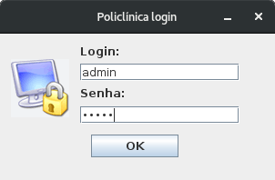
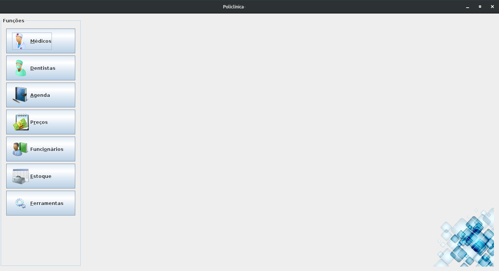
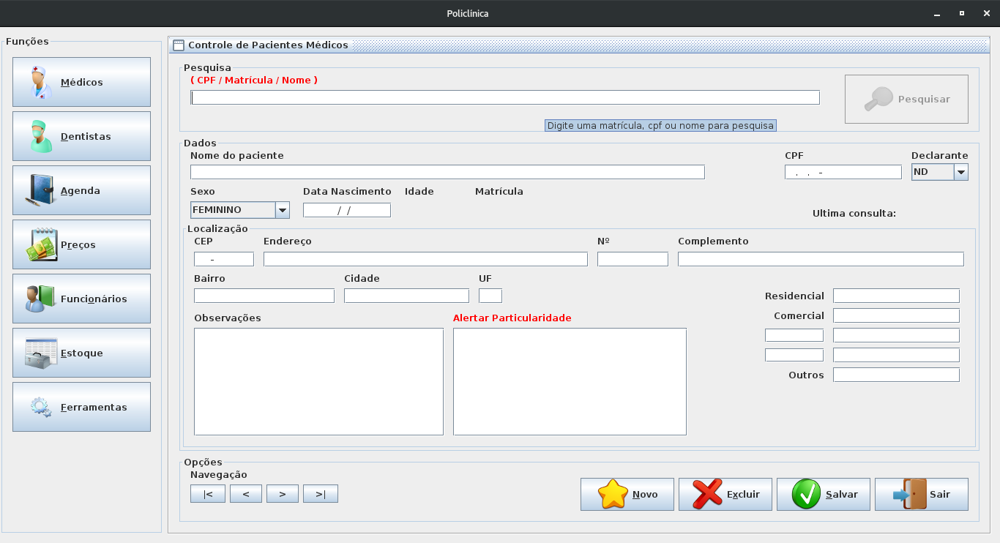
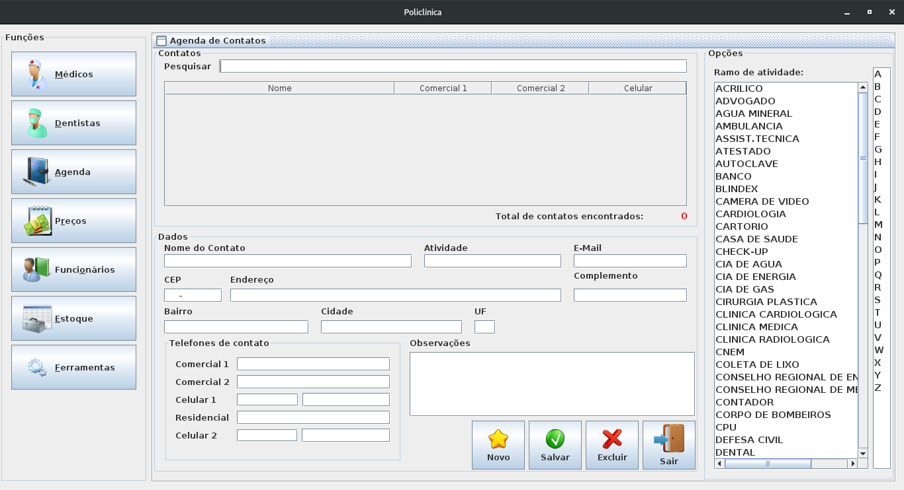
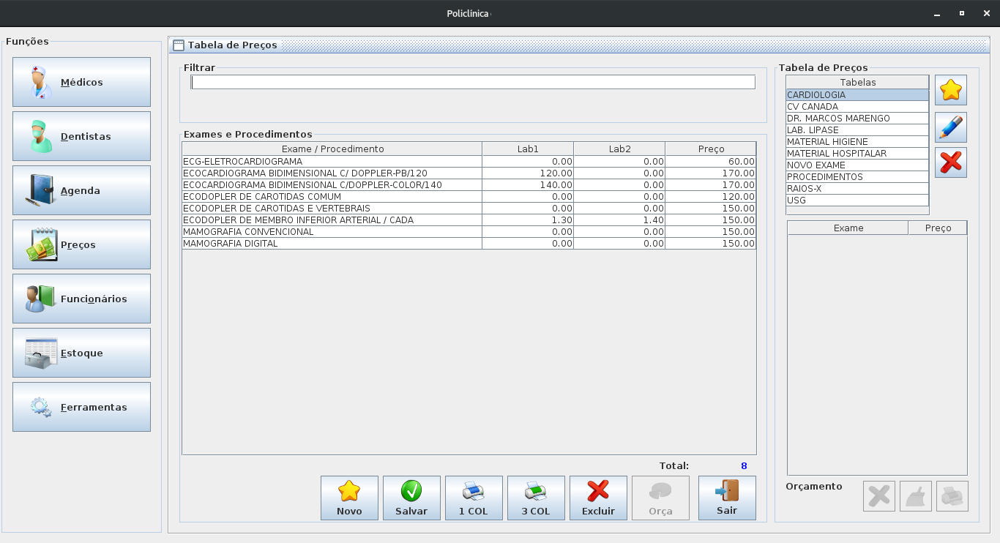
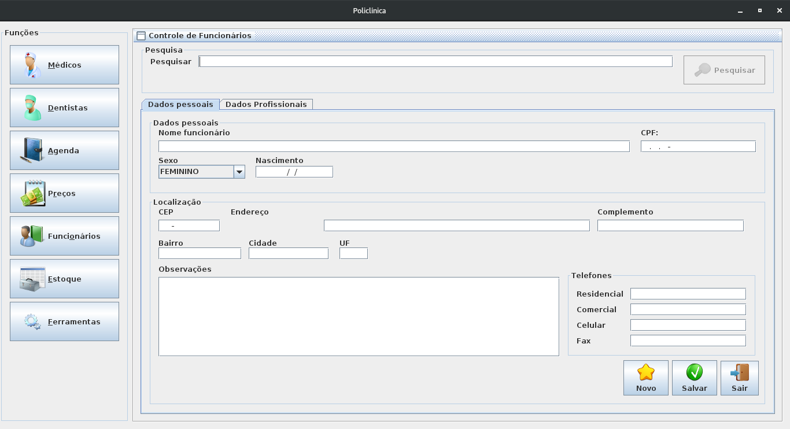
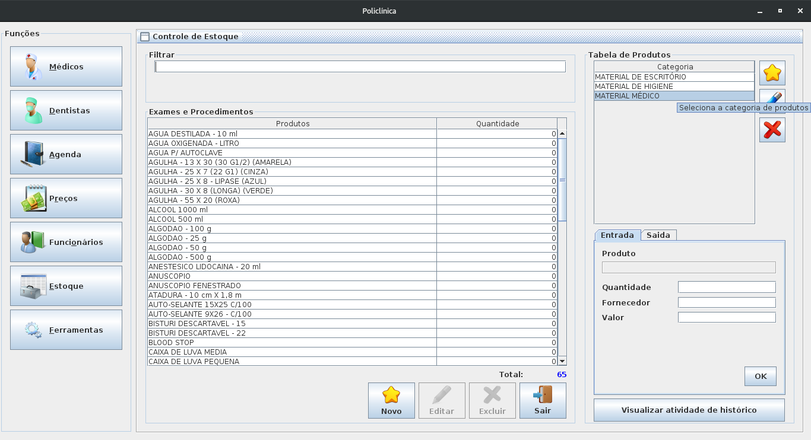
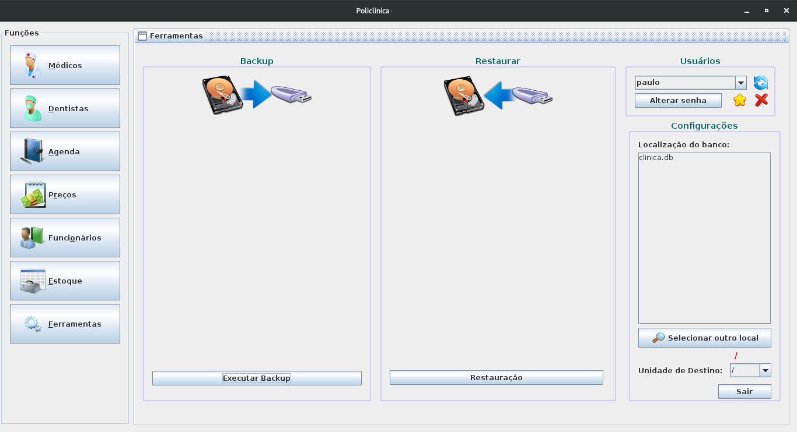

# Programa Clínica.

Programa criado para gestão de clínica médica.

## Screenshots

### Tela de login

### Tela principal

### Telas Cadastro de Paciente

### Tela de agenda de contatos

### Tela tabela de preços

### Tela de controle de funcionários

### Tela controle de estoque

### Tela de ferramentas

## Descrição
- Projeto criado utilizando NetBeans
- Banco de dados criado em SQLite3 ( mas pode ser com MySQl/MariaDB)

## Observações
> Este projeto não está mais em desenvolvimento, sendo utilizando somente para consulta
> Fique a vontade para copiar alterar e distribuir.

## Licença MIT
Licença MIT [MIT License](LICENSE)

---
Criado em 2015
